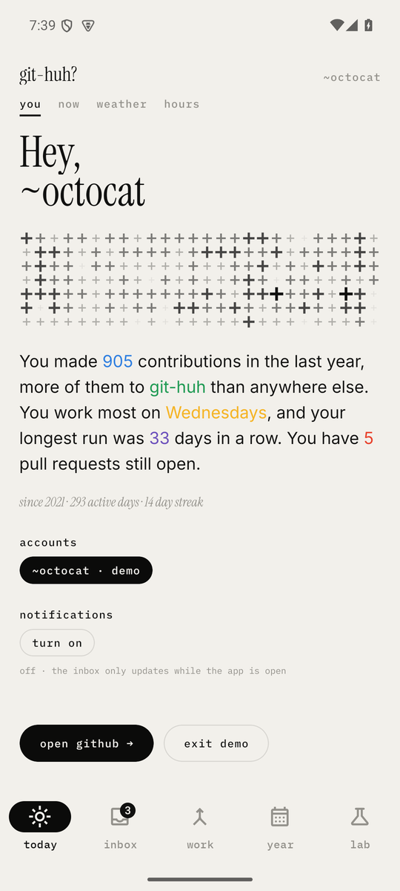
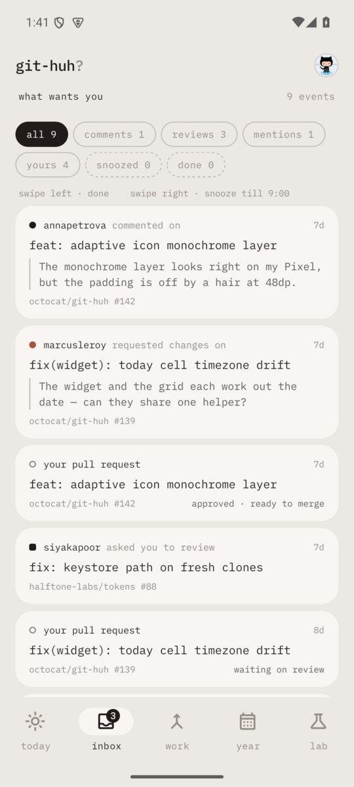
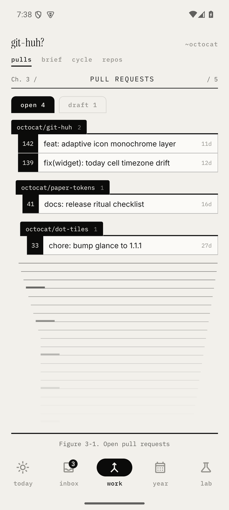
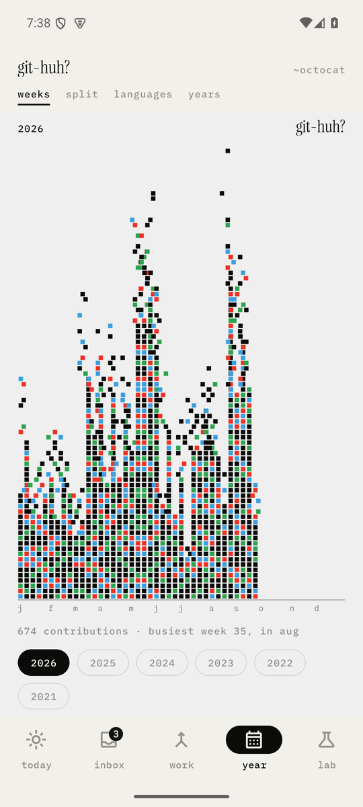

# git-huh?

Your GitHub history drawn the way its home-screen widget draws it — your own
commit messages travelling across a card, the days as dots under them — plus an
inbox you can clear from your phone.

> **Alpha.** Built and used daily on Android. The iOS app and widget are
> generated from the same code but have not been through a device yet.

<p>
  
  
  
  
</p>

## What it is

GitHub already knows a lot about how you work. git-huh draws it: seventeen
screens, each laid out after a pin from a moodboard (an IBM poster, a
correspondence drawer, a Sankey diagram, a weather app, letters on a
spiral) and drawn in the home-screen widget's marks — one mono face, one ink,
dots whose size is the data, a plus for today, a wave for a silence — in five
sections on the system's own tab bar.

| section | views | |
|---|---|---|
| **today** | you · now · weather · hours | the widget with room to breathe and a feed that keeps going, today in lit dots, your streak as a forecast, when in the day you commit |
| **inbox** | recent · review · assigned | review requests, mentions, reviews and replies — swipe to mark done or snooze until morning; the review queue, longest wait first, with what moved since you looked; everything assigned to you across every repository |
| **work** | pulls · brief · cycle · repos | your open pull requests, one read in full, time to merge, a deck of repositories |
| **year** | weeks · split · languages · years · people | every year of contributions, where they went, what they were written in, and who you reviewed with |
| **ideas** | project ideas | a simple notebook saved on this device, with add, edit and delete |

It also does the things that usually end with "I'll do it on the laptop":

- **Review and reply.** Approve, request changes, comment on any line of a
  diff (including unchanged ones), reply to issues and discussions, close an
  issue.
- **CI.** Checks and workflow runs on a pull request, the tail of a failing
  log, re-run failed jobs, approve a first-time contributor's run or a
  pending deployment.
- **Repositories.** Browse files, search the code, read releases, open
  issues (issue forms included), discussions and Dependabot alerts.
- **Small changes.** Edit a file and propose it as a pull request. Without
  push access it goes through a fork, the way the website does it.
- **Notifications without a server.** Android wakes the app about every
  fifteen minutes; anything new that is addressed to you becomes a
  notification. Nothing is pushed from anywhere.
- **Offline.** Every screen draws the last answer it saved, marked with its
  age, before the network replies.
- **Several accounts**, switched from the avatar in the corner, and added up
  into one year if your work is split between a work login and your own.
- **Share a chart** as a 4:3 image, drawn for a timeline rather than cropped
  from the phone.
- A **demo** with generated data if you want to look before signing in.

The widget is the dot field and a line from your own history, travelling
across the card: no counts, no badges, today marked with a plus in the corner.
It sits on your wallpaper's Material You colour.

## Privacy

There is no git-huh server. The app talks to `api.github.com` and nothing
else: no analytics, no crash reporting, no accounts. Tokens are kept in the
Android Keystore (iOS Keychain), and everything the app caches stays in its
own storage on the phone. Removing an account deletes what was saved for it.

## Install

Download the APK from the [latest release](https://github.com/jaikhuranna/git-huh/releases)
and open it on your phone (Android 7 or newer; the widget's travelling line and
wallpaper colour need Android 12). You will be asked to allow installs from
your browser or file manager.

Then tap **sign in with github**: the app shows an eight-letter code, you
enter it at github.com/login/device, and it signs in. There is no password
field and no redirect, and the app has no client secret. It uses OAuth's device flow, so
nothing but GitHub ever sees the token. An organisation that restricts
third-party apps stays hidden until it approves git-huh; the account page
links to where you ask.

Or paste a [classic personal access token](https://github.com/settings/tokens/new?scopes=read:user,repo,read:discussion,write:discussion,security_events&description=git-huh)
with the same scopes (a fine-grained token works too), or tap **try the demo**:

| scope | what it is for |
|---|---|
| `read:user` | your profile and contribution calendar |
| `repo` | private contributions, pull requests, files and every write |
| `read:discussion`, `write:discussion` | reading and answering discussions |
| `security_events` | Dependabot alerts |

Every screen works with less and says what a missing scope costs. The one
that matters is `repo`: without it GitHub answers with only the public half
of your year, and quietly. The app tells you when that is happening.

## Build it

You need Node 20 or newer, JDK 17 or newer and the Android SDK. iOS needs a
Mac with Xcode 26.

```bash
npm install
npx expo run:android          # debug build on a device or emulator
npx expo prebuild -p ios      # generates ios/, including the widget target
```

The Android project is committed rather than generated, because the widget is
hand-written native code. A release build:

```bash
cd android
./gradlew assembleRelease -PreactNativeArchitectures=arm64-v8a
```

It signs with `GITHUH_UPLOAD_*` from `~/.gradle/gradle.properties` if you
have set them, and with the debug key if you have not.

**Sign in with GitHub** needs an OAuth app. [Register one](https://github.com/settings/applications/new)
(any homepage and callback URL; neither is used), tick **Enable Device
Flow**, and put its client id in `app.json` → `expo.extra.githubClientId`. A
client id is not a secret, and no secret is needed. With the field empty the
sign-in page offers the token field alone.

Checks:

```bash
npm run typecheck
npm run lint
npm test
```

## How it is put together

React Native 0.86 on Expo SDK 57, TypeScript throughout, Zod at every
boundary with GitHub.

- **`src/shell/`** holds the app's state above the navigator: the token, the
  year, the inbox, the stack of pushed pages. Screens are memoised and redraw
  only when their own data changes.
- **`src/hooks/useRemote.ts`** is the one loading pattern: the saved answer is
  drawn first, the fresh one replaces it, and offline the saved one stays up
  with its age. A revoked token still fails loudly.
- **`src/lib/`** is the data layer: GraphQL where GitHub offers it, REST where
  it does not (commit search, file patches, Actions), one error type for both,
  and the pure logic (routing, the year model, diffs, activity maths, issue
  forms) under unit tests.
- **`src/lib/notify.ts`** is the background inbox check. It is defined from
  `index.js` before the router loads, because Android starts the JavaScript
  runtime headless to run it.
- **`android/app/src/main/java/app/githuh/widget/`** is the Glance widget. Its
  text, dots and wave are painted into bitmaps, because a home-screen widget
  cannot use the app's fonts. The line moves by flipping pre-painted frames,
  because nothing in a widget can animate from code.
- **`targets/widget/`** is the iOS widget in SwiftUI, reading the same payload
  through an App Group.

The design is written down before it is built:
[`design/LANGUAGE.md`](design/LANGUAGE.md) (the rules),
[`design/DESIGN.md`](design/DESIGN.md) (every screen) and
[`design/STORIES.md`](design/STORIES.md) (who it is for, and what people want
from a GitHub app and dislike about GitHub's own).

## Licence

[GNU GPL v3.0 or later](LICENSE). You can use, change, share and even sell
git-huh, as long as anything you ship from it is GPL too, with its source.
Issues and pull requests are welcome.
Third-party fonts and icons are listed in
[`THIRD-PARTY-NOTICES.md`](THIRD-PARTY-NOTICES.md).

git-huh is not affiliated with GitHub.
